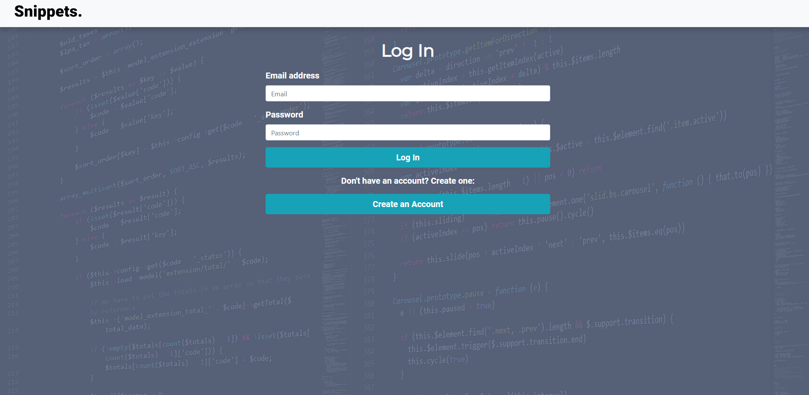
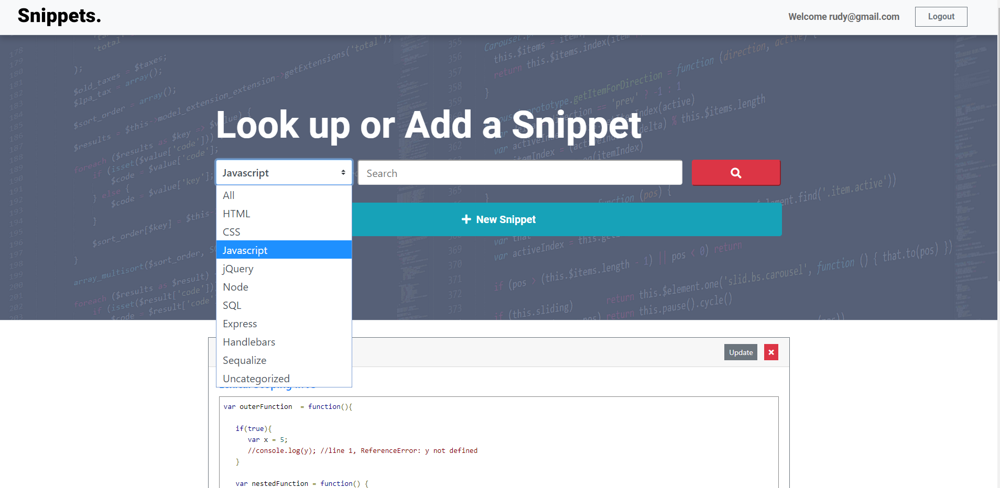
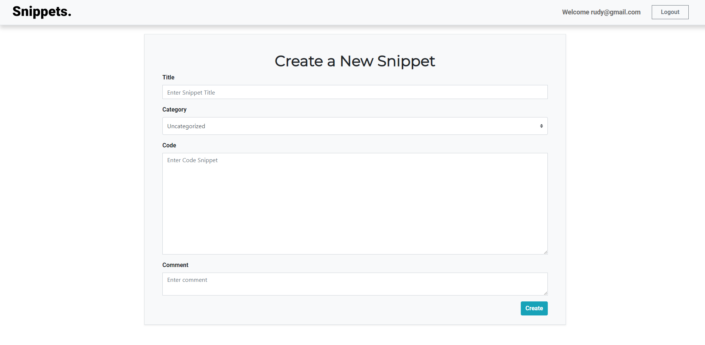

 
Snippets makes it easier to organize and save code for later use.

## Overview
Searching for logic needed to make your app work often takes __A LOT__ of googling and review of hundreds of lines of code. Snippets is a place where you can select a category (i.e., HTML, CSS, Javascript, Sequelize) and save code or links that can be stored and retreived when needed for future projects.

## Features
:boom: A login and sign up page that requires email and password authentication.  
   

:boom: Once logged in the user can select a category and search for code or save a snippet for later use.  
   

:boom: Users can create new snippets by entering a title, category, pasting the snippet, and adding a comment.  
   

## New Modules we Learned:
* [Prettier](https://www.npmjs.com/package/prettier)
* [Passport](https://www.npmjs.com/package/passport)
* [bCrypt](https://www.npmjs.com/package/bcrypt)
* [body-parser](https://www.npmjs.com/package/body-parser)

## Areas we Improved in:
* Sequelize
* eslint
* Handlebars
* Express

## Future Developments
* Tie logged in user to Snippets
* Personalized view
* Allow users to create and delete their own categories.
* Importing/Exporting
* Implement Dark Mode.
* Add color to code snippets for better readability.

### [Go to Snippets!](https://morning-harbor-79094.herokuapp.com/)

